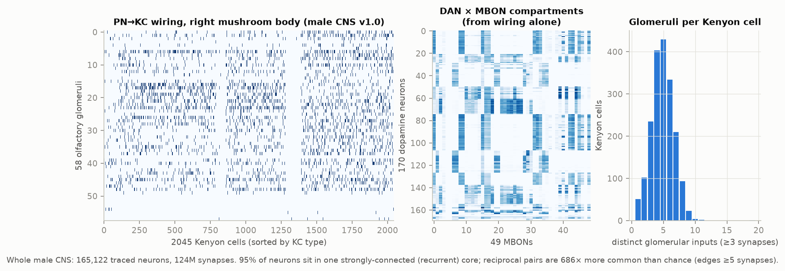
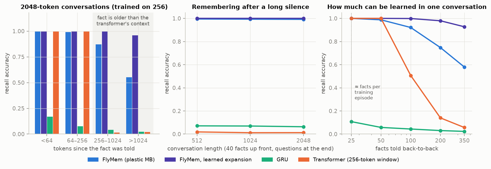
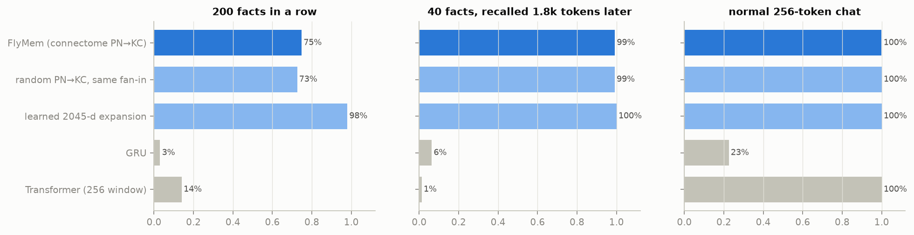
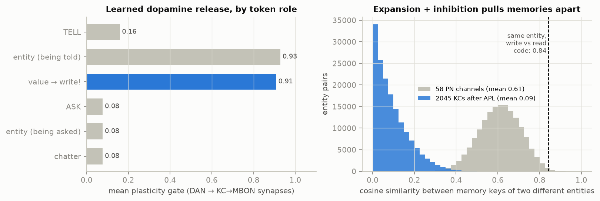
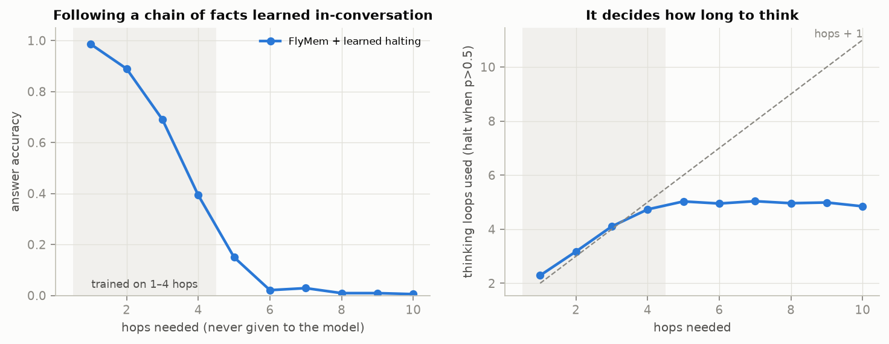
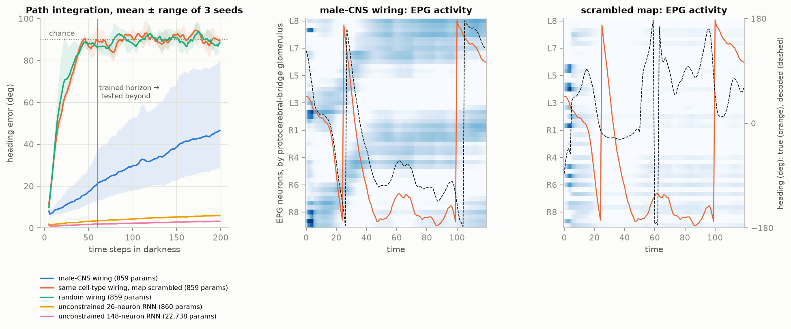

# adaptive-mind: a fly-wired model that learns while you talk to it

> Status: a weekend-scale research prototype, trained and evaluated on 4 CPU cores.
> Every number below comes from `results/` and can be regenerated with the commands at the end.

## The idea in one paragraph

Language models "learn" inside a chat only by keeping text in a context window
and attending over it. The fly does something different: it changes its
synapses. In the mushroom body, a dopamine pulse changes the strength of the
synapses between the few Kenyon cells that are active right now and the output
neurons. The fly doesn't keep a transcript. The experience is stored in the
wiring, the storage is constant-size, and it keeps working however long the
fly's "conversation" runs. This folder builds that mechanism with the actual
wiring measured in the new **Drosophila male CNS connectome** (Janelia FlyEM +
Cambridge + Google + FlyWire, v1.0, 2025/26). It meta-trains the few things
the connectome doesn't specify, and asks three questions:

1. **Can it learn during inference?** New facts, told mid-conversation, stored
   only in fast synapses, then recalled far beyond any context window.
2. **Can it decide how hard to think?** A recurrent "thinking loop" re-reads its
   own synaptic memory and learns when to stop (adaptive recurrent effort).
3. **Does the fly's wiring itself carry function?** Rebuild the heading compass
   (central complex) neuron-for-neuron from the connectome, train only ~860
   scalars, and compare with rewired controls.

What is *not* new: fast weights (Hinton & Plaut 1987; Schmidhuber 1992; Ba et al.
2016), differentiable/neuromodulated plasticity (Miconi et al. 2018, 2019), the
delta-rule memory (DeltaNet; Schlag et al. 2021, Yang et al. 2024), and
test-time-learning memories (TTT layers, Titans 2024–25) are the ML ancestors. The
random sparse expansion reading of the mushroom body is the "fly hash" (Dasgupta
et al. 2017). ACT/PonderNet (Graves 2016; Banino et al. 2021) supplies the halting
rule. Connectome-constrained networks are Lappalainen et al. 2024 and Shiu et al.
2024. What *is* new here is putting these together with the real male-CNS
wiring, and treating a chat as the fly's lifetime.

---

## 0. What the connectome says (`connectome.py`)



From 165,122 traced neurons and 124 M synapses:

* **The brain is overwhelmingly recurrent.** 95% of all neurons sit in a single
  strongly-connected component (edges ≥ 5 synapses). Reciprocal connections are
  **686× more common than chance**. A feed-forward stack is the wrong template.
* **The right mushroom body is an expansion coder:** 58 glomeruli → 148
  uniglomerular projection neurons → **2,045 Kenyon cells**. Each KC samples about **5**
  glomeruli (median 5), so the expansion is ×35.
* **One inhibitory neuron (APL) touches 99.95% of Kenyon cells**, and 99.95% of
  KCs talk back to it. That's global feedback inhibition, i.e. a k-winners-take-all.
* **170 dopamine neurons × 49 output neurons form compartments.** Their block
  structure falls out of the wiring alone (cosine of DAN→KC and KC→MBON profiles,
  middle panel). **MBON→DAN feedback** exists (3,420 synapses), so the learning
  circuit is itself a loop.
* The heading circuit (EPG, PEN_a/b, PEG, Δ7): 148 neurons, 8,910 edges,
  138k synapses, **69% of connections reciprocal**.

These numbers set the model's architecture directly: 58 PN channels, the real
2,045-column PN→KC synapse matrix, 5% KC activity via an APL-like k-WTA, 49
MBONs, 170 DANs whose reach onto MBONs is the measured compartment matrix.

## 1. FlyMem: learning at the synapse (`models.py`, `train_memory.py`)

```
token ─► GRU controller ─► 58 PN ─► [connectome PN→KC, fixed] ─► 2045 KC ─► APL k-WTA (5%)
                     │                                                       │ k (sparse key)
                     ├──► value v (49 MBON targets)                          ▼
                     └──► 170 DANs ─► [connectome DAN→MBON compartments] ─► gate g
             fast synapses  W ← W + g ⊙ (v − W k) kᵀ      (starts at 0 every conversation)
             readout        r = W k  ─► answer head
```

The slow weights (embeddings, controller, PN/DAN/value projections, head) are
meta-trained over many short conversations. Each conversation invents a fresh
world, so no fact can live in the slow weights. The fast synapses start empty in
every conversation and change *only* by the local, dopamine-gated rule while the
model reads. The update is exact and runs chunk-parallel (a unit-triangular solve
per MBON, see `delta_memory`), so training is fast even on a CPU.



Every model is trained on 256-token conversations only (~25 facts, some of
them later overwritten). The test conversations run up to 2,048 tokens.

| model | trainable params | recall in a normal 256-token chat | 40 facts, asked 1.8k tokens later | 100 / 200 / 350 facts in one go |
|---|---|---|---|---|
| **FlyMem** (connectome PN→KC) | 189k | 99.9% | **99.1%** | 92 / 75 / 58% |
| **FlyMem, learned expansion** | 425k | 100% | **100%** | **100 / 98 / 93%** |
| Transformer, 256-token window | 672k | 100% | 1.3% | 51 / 14 / 6% |
| GRU (memory in activations) | 364k | 22.5% | 6.3% | 4 / 3 / 2% |

* The transformer is perfect **inside** its window and at chance outside it, by
  construction. FlyMem has no window: its memory is a fixed 49 × 1,887 synapse
  matrix that doesn't grow with the conversation, and it keeps working at 8× the
  training length.
* FlyMem learned its skill in ~200 training steps. The transformer sat on the
  well-known induction-head plateau (≈20% for 2,000 steps at lr 2e-3). It needed
  a short-conversation curriculum to become a fair baseline.
* A plain GRU of similar size can't hold 25 arbitrary bindings in its
  activations. This is the gap that synaptic memory fills.

**Ablations** (`figures/memory_ablations.png`):



* **Real PN→KC wiring = random wiring with the same fan-in** (92% vs 91% at 100
  facts). That agrees with the anatomy literature: fly PN→KC connectivity is
  close to random (Caron et al. 2013). The function is in the *statistics*
  (sparse, ~5 inputs, ×35 expansion), not in the individual synapses.
* **Learning the expansion beats fixing it.** A learned 2,045-unit projection with
  the same APL-style sparsening raises capacity at 350 facts from 58% to 93%.
  The fly can't retrain its PN→KC wiring every lifetime, but a machine can.
* No-expansion, no-APL and plasticity-off ablations: see the figure (added when those
  runs finish).

## 2. What it learned to do with its dopamine



Nobody told the model *when* to learn. Meta-training shaped its 170 dopamine
neurons so the plasticity gate opens (~0.9) exactly when a fact is being told,
and stays nearly shut (~0.08) during questions and chatter. That's the fly's
own logic: dopamine marks the moments worth remembering.

The PN→KC expansion plus APL inhibition also does what it does in the fly. At
the positions where the memory is actually read and written, the codes for two
different entities overlap with cosine **0.61** in the 58 PN channels but
**0.09** in the 2,045 Kenyon cells (5% active). The write and read codes of the
*same* entity still match at **0.84**. So memories stop interfering with each
other without losing their address.

## 3. Learning from praise and correction only (`--task feedback`)

A harder version of learning on the job: nobody ever states the answer. Someone
tries an answer (`ASK e g`) and hears `YES` or `NO`. The model must work out
the right value from the feedback alone, like a fly learning which odour is
punished. There are 4 options per conversation, and an ideal Bayesian observer
scores 51% overall (100% once a YES has been heard, 1/(4 − #NOs) otherwise).

**Result: not solved yet.** Both FlyMem and a curriculum-trained transformer
learned the option set (≈25% before any feedback, i.e. the right chance level),
but they reach only 35–40% after hearing YES and don't use NO at all (overall
28% vs the ideal 51%). Training loss was still falling slowly. This is a
harder meta-learning problem than learning from stated facts, and the budget
here (1.5–3k steps on a CPU) is too small for it. It's the most promising thing
to scale up, since it is the closest to what the mushroom body is for.

RESULTS_FEEDBACK_EXTRA

## 4. Adaptive recurrent effort: thinking in loops (`ponder.py`)



The conversation contains links `LINK a b`, `LINK b c`, … in shuffled order, and
the question `QUERY a` asks where a's chain ends. The number of hops is never
given. The model answers by looping: it uses the current thought as a sensory
cue into its plastic memory (PN→KC→APL, as when the fly smells an odour),
reads the MBONs, updates the thought, and a learned halting unit
(PonderNet) decides whether to stop.

| hops needed | 1 | 2 | 3 | 4 | 5–10 (never trained) |
|---|---|---|---|---|---|
| accuracy | 99% | 89% | 69% | 39% | ≤ 15% |
| loops it chose | 2.3 | 3.2 | 4.1 | 4.7 | ~5, then gives up |

* **It learned to think longer on harder questions**, at close to *hops + 1* loops:
  one memory read per hop, plus one to notice that the chain has ended. The
  "end" signal is simply that the memory returns nothing, a familiarity
  signal much like the MB's novelty responses.
* **It doesn't extrapolate.** Beyond the trained range the loop count saturates
  near 5, and errors compound per hop (≈ 0.9 per hop in range).
* Two things were needed to make it work at all:
  1. **Key the memory on the sensory code of the cue**, as the fly does, instead
     of on the controller's summary of the context.
  2. **Don't start with 1-hop-only training.** Otherwise the halting unit
     collapses to "always stop after one loop", and later loops receive almost
     no gradient.

RESULTS_PONDER_EXTRA

## 5. Rebuilding the fly's compass from the male connectome (`cx.py`)



148 neurons (46 EPG, 20 PEN_a, 22 PEN_b, 18 PEG, 42 Δ7) wired exactly as in the
male CNS: synapse counts, with signs from predicted transmitters (ACh +,
Glu/GABA −). Trainable: 25 cell-type-to-cell-type gains, 148 biases, input
gains (angular velocity → PENs only, landmark → EPGs only) and a linear
readout from EPGs. That's 859 numbers. Task: see a landmark for 5 steps, then
keep track of heading in darkness from self-motion alone.

| wiring (same 859 trainable numbers unless noted) | error at trained horizon | error at 3× horizon |
|---|---|---|
| **male-CNS connectome** | **9.1°, 9.0°, 20.7°** (3 seeds) | 21°, 21°, 61° |
| same cell-type wiring, neuron-level map scrambled | 66–71° | ~90° (chance) |
| random wiring, same edges and weights | 65–78° | ~90° (chance) |
| unconstrained 26-neuron RNN (860 params) | 2.4–2.7° | 4.6–5.3° |
| unconstrained 148-neuron RNN (22.7k params) | 1.4° | 2.6° |

* **The wiring carries the function.** With identical parameters, only the
  real neuron-to-neuron map integrates heading. Scrambling it inside each
  cell-type pair (same types, same synapse counts, same parameter count)
  drops performance to near chance.
* **But it's not more parameter-efficient than a free network** of the same
  size, and it drifts over long horizons. Its EPG activity (middle panel)
  follows heading along the protocerebral-bridge axis but is broader than the
  crisp bump real flies show. The likely missing pieces are the ring (ER)
  neuron input, neuron-level gains and the real neuronal time constants.
* Training on a 2× longer horizon made it worse (41° on the first seed), which
  suggests an optimisation problem rather than a capacity limit.

---

## Try it

```bash
pip install torch numpy pandas pyarrow scipy matplotlib
python chat.py               # talk to it; teach it facts, overwrite them, ask later
python chat.py --script      # the canned demo
```

```
> alice is red
(dopamine gate on write: 0.93)
> bob is blue
> the weather is lovely today and i had a sandwich for lunch
> alice?
alice is red.   [red 100%, ...; gate on read 0.08]
> alice is yellow
> alice?
alice is yellow.
```

## Reproduce

```bash
# 0. connectome (≈570 MB download; the distilled circuits are already in data/)
B=https://storage.googleapis.com/flyem-male-cns/v1.0/connectome-data/flat-connectome
for f in body-annotations-male-cns-v1.0-minconf-0.5.feather body-neurotransmitters-male-cns-v1.0.feather \
         connectome-weights-male-cns-v1.0-minconf-0.5-traced-only.feather; do curl -O $B/$f; done
python connectome.py --src .
# 1-3. memory, ablations, feedback
./run_memory_suite.sh
python train_memory.py --task feedback --model fly --steps 1500
# 4. pondering
python ponder.py --steps 2500
# 5. central complex
python cx.py --steps 1500 --seeds 3
python make_figures.py
```

## Files

| file | what |
|---|---|
| `connectome.py` | male-CNS → circuit specs (`data/*.npz`, `data/connectome_stats.json`) |
| `models.py` | FlyMem, the chunk-parallel gated delta rule, GRU / transformer baselines |
| `tasks.py` | conversation streams: facts, feedback-only, chains |
| `train_memory.py` | experiments 1–3 |
| `ponder.py` | adaptive-effort experiment |
| `cx.py` | connectome-constrained heading circuit + controls |
| `chat.py` | interactive demo |
| `make_figures.py` | all figures |
